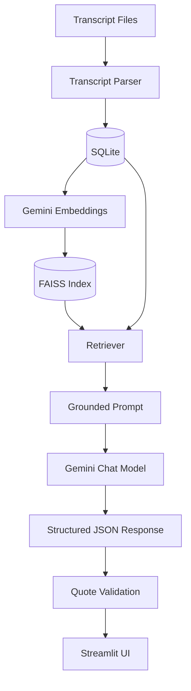

# Hasamex AI Engineer – Technical Case Study

An AI-powered Streamlit application that analyzes three expert-call transcripts
about hospital adoption of robotic surgery in France, Germany and the United
Kingdom. Every AI-generated answer is grounded in retrieved transcript
evidence and traceable back to an exact quote and timestamp.

## 1. Project Overview

The app reads the three supplied transcripts and the interview guide, then
lets you:

- Get an AI-generated answer to every interview-guide question, per expert,
  each backed by an exact quote and timestamp from that expert's own
  transcript.
- See common themes and genuine differences/disagreements across all three
  experts.
- Ask any free-form question across all three transcripts.

Nothing is answered from the model's general knowledge - only from the
supplied transcripts.

## 2. Features

- **Interview Guide** page: select an expert, get AI Summary + Supporting
  Evidence + Timestamp + Source for every question.
- **Cross-Call Analysis** page: common themes and differences, with
  "Difference in emphasis" used instead of "Disagreement" unless the experts'
  statements genuinely conflict.
- **Ask the Transcripts** page: a chat-style Q&A box over all three
  transcripts.
- **Exact quote validation**: every quote the model proposes is checked
  against the real transcript text before it is shown. Unverifiable quotes
  are dropped and replaced with "Insufficient evidence in the transcript."
- **Timestamps sourced from metadata only** - never generated by the LLM.
- Automatic first-run database + vector index setup.

## 3. Architecture

```
Transcript files (.txt)
        │
        ▼
Transcript Parser  (src/transcript_parser.py)
        │
        ▼
SQLite  (src/database.py)  ── experts / transcripts / transcript_segments
        │
        ▼
Gemini Embeddings  (src/embeddings.py)
        │
        ▼
FAISS Vector Index  (src/vector_store.py)
        │
        ▼
Retriever  (src/retriever.py)  ── semantic search, optional per-expert filter
        │
        ▼
Grounded Prompt  (src/prompts.py)
        │
        ▼
Gemini Chat Model  (src/llm_client.py)
        │
        ▼
Structured JSON Response
        │
        ▼
Quote Validation  (src/quote_validator.py)  ── rejects unverifiable quotes
        │
        ▼
Streamlit UI  (app.py)
```

## 4. Architecture Diagram (Mermaid)



## 5. Tech Stack

- Python
- Streamlit
- LangChain (`langchain`, `langchain-community`, `langchain-google-genai`)
- Google Gemini (chat + embeddings)
- FAISS (`faiss-cpu`) for semantic vector retrieval
- SQLite for relational/persistent storage
- python-dotenv for configuration
- pytest for tests

No PostgreSQL, MongoDB, Redis, Docker, React, Node.js, FastAPI, Celery or
Kubernetes is used - this is intentionally a small, understandable project.

## 6. Project Structure

```
hasamex-ai-case-study/
│
├── app.py
├── requirements.txt
├── README.md
├── .env.example
├── .gitignore
│
├── data/
│   ├── Interview_Guide.txt
│   ├── Transcript_1_France.txt
│   ├── Transcript_2_Germany.txt
│   └── Transcript_3_UK.txt
│
├── database/            # SQLite file is created here at runtime
├── vectorstore/         # FAISS index files are created here at runtime
│
├── src/
│   ├── __init__.py
│   ├── config.py
│   ├── database.py
│   ├── transcript_parser.py
│   ├── embeddings.py
│   ├── vector_store.py
│   ├── retriever.py
│   ├── interview_analyzer.py
│   ├── cross_call_analyzer.py
│   ├── qa_engine.py
│   ├── quote_validator.py
│   ├── prompts.py
│   └── llm_client.py     # small shared helper: Gemini call + JSON parsing
│
└── tests/
    ├── test_parser.py
    └── test_quote_validator.py
```

## 7. Setup Instructions

```bash
python -m venv .venv
source .venv/bin/activate        # Windows: .venv\Scripts\activate
pip install -r requirements.txt
cp .env.example .env
```

Edit `.env` and add your Google AI Studio API key:

```
GOOGLE_API_KEY=your-key-here
```

## 8. Environment Variables

| Variable                       | Purpose                                             | Default                 |
|--------------------------------|------------------------------------------------------|--------------------------|
| `GOOGLE_API_KEY`                | Gemini API key (required)                            | *(none)*                 |
| `GEMINI_MODEL`                  | Chat model used for analysis                         | `gemini-3.6-flash`       |
| `GEMINI_EMBEDDING_MODEL`        | Embedding model used for FAISS                       | `models/embedding-001`   |
| `GEMINI_TEMPERATURE`            | Sampling temperature                                 | `0.0`                    |
| `RETRIEVAL_TOP_K`               | Segments retrieved per question                      | `6`                      |
| `CROSS_CALL_TOP_K_PER_EXPERT`   | (reserved) segments per expert for cross-call         | `8`                      |

`GEMINI_MODEL` and `GEMINI_EMBEDDING_MODEL` can be changed at any time
without touching source code.

## 9. How to Run

```bash
streamlit run app.py
```

On first run the app will automatically:

1. Create the SQLite database and tables if they do not exist.
2. Parse the three transcripts and the interview guide.
3. Build the FAISS vector index and save it to `vectorstore/`.

On later runs, the existing database and index are reused (Streamlit
`@st.cache_resource` also prevents rebuilding on every UI interaction within
a running session).

## 10. How Transcript Ingestion Works

Each transcript file starts with a small header (`Expert N - Name`,
`Role: ...`, `Market: ...`) followed by repeating `TIMESTAMP` / `Speaker:
text` blocks. `src/transcript_parser.py` extracts the header and then splits
the rest of the file on timestamp lines (e.g. `00:18`) to produce one
`TranscriptSegment` per dialogue turn, preserving the original wording and
timestamp exactly. These segments are written to the `transcript_segments`
table in SQLite (`src/database.py`).

## 11. How RAG Works

Each transcript segment becomes a LangChain `Document` whose metadata
carries `expert_name`, `role`, `market`, `source_file`, `timestamp` and
`speaker`. These documents are embedded with Gemini embeddings and stored in
a FAISS index (`src/vector_store.py`). `src/retriever.py` performs semantic
similarity search over that index, optionally filtered to a single expert.
Retrieved segments (never the full transcript) are inserted into a grounded
prompt (`src/prompts.py`) instructing Gemini to answer only from that
evidence, and the model's response is requested as structured JSON.

## 12. How Citations/Timestamps Work

The LLM is asked to include an exact quote as part of its structured
response, but it is never trusted to also report the timestamp. Instead,
`src/quote_validator.py` checks (after whitespace normalization only) whether
the proposed quote occurs verbatim inside one of the retrieved segments. If
it does, the timestamp, speaker, market and source file are read back from
that segment's own metadata - not from the model. If no match is found, the
quote is discarded and the answer is downgraded to "Insufficient evidence in
the transcript."

## 13. Hallucination Mitigation

- Retrieval-grounded prompts containing only relevant transcript segments.
- Low/zero temperature and explicit "answer only from supplied evidence"
  instructions repeated in every prompt.
- Structured JSON output instead of free text, so responses can be validated
  programmatically.
- A deterministic quote-validation function that rejects any quote not found
  verbatim (whitespace-normalized) in the transcript.
- Timestamps always sourced from segment metadata, never generated by the
  model.
- Explicit "Insufficient evidence in the transcript." fallback whenever
  evidence is missing or a quote cannot be verified.
- Careful language for cross-call findings: "Difference in emphasis" is used
  instead of "Disagreement" unless statements genuinely conflict.

## 14. Design Decisions

- **SQLite** because the relational data (experts, transcripts, segments,
  cached analysis results) is small and local - no separate server needed.
- **FAISS** for fast, local semantic search without a hosted vector database,
  appropriate for three short transcripts.
- **Structured JSON responses** from Gemini instead of free text, so answers
  can be programmatically checked before being shown.
- **Caching analysis results** in the `analysis_results` table so repeatedly
  viewing the same expert/question in the UI does not re-call the LLM.
- **Plain functions over abstractions/design patterns** to keep the codebase
  easy to explain in a technical interview.

## 15. Limitations

- Quote validation is exact-match (after whitespace normalization), so a
  quote the model paraphrases even slightly is rejected rather than
  partially credited. This is a deliberate, conservative trade-off in favor
  of never showing an unverifiable quote.
- Cross-call theme/difference detection is a single LLM call over all
  segments; this would not scale well to a much larger transcript corpus.
- Retrieval quality depends on the Gemini embedding model and the small size
  of the transcript corpus (semantic search over ~14 segments per expert is
  a small search space).
- The interview-guide questions are matched to transcript content generally,
  not with any manually curated ground truth.

## 16. Scaling from 3 Transcripts to 30+

**Not implemented in this version** - the current implementation stays
intentionally simple. A larger version could add:

- Background ingestion pipeline instead of parsing on first Streamlit run.
- A persistent, server-based vector database instead of a local FAISS file.
- PostgreSQL instead of SQLite once concurrent writes/multiple users matter.
- Transcript/project IDs and richer metadata filters for multi-project use.
- Batched embedding generation and caching to control API cost.
- Asynchronous processing for ingestion and analysis jobs.
- Stronger evaluation/observability (logging, quote-validation metrics,
  retrieval quality checks).

## 17. Testing

```bash
pytest tests/ -v
```

Covers:

1. The transcript parser correctly extracts timestamps, speakers, header
   metadata and preserves original wording.
2. The quote validator accepts a genuine quote (with harmless whitespace
   differences) and correctly reads back its timestamp.
3. The quote validator rejects a fabricated quote.
